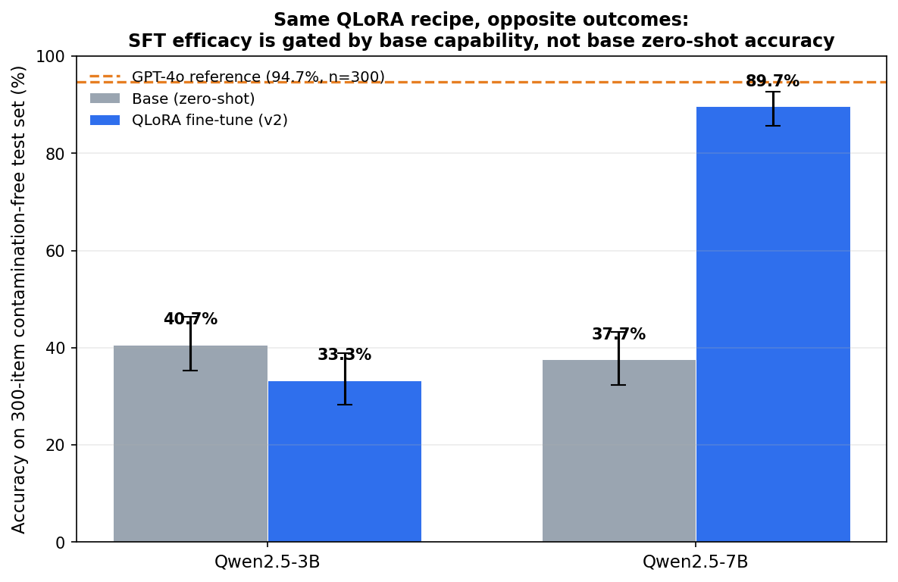

# Specialising a small LLM on Leaving Cert calculus: A QLoRA scaling study

**TL;DR** - I fine tuned Qwen 2.5 (3B & 7B) with QLoRA on synthetically generated, symbolically verifiable Irish Leaving Cert Higher Level calculus, entirely on a MacBook Pro (Apple MLX, 4 bit). The identical recipe **regressed the 3B by 7 points but lifted the 7B by 52 points** - despite the two base models being statistically indistinguishable zero shot (40.7% vs 37.7%, McNemar n.s). The finding: **SFT efficacy here is gated by base capability, not base zero-shot accuracy.** The fine-tuned 7B reaches **89.7%**, within 5 points of GPT-4o (94.7%) on a 300-item contamination-free test set — at zero marginal cost, offline, on a laptop.

## Headline results

All models were evaluated on the *same* 300 freshly sythesised items, graded by the *same* SymPy symbolic grader, parsed by the *same* parser, 95% Wilson intervals 

| Model | Accuracy | 95% CI |
|---|---|---|
| Qwen2.5-3B base (zero-shot) | 40.7% | [35.3–46.3] |
| Qwen2.5-3B + QLoRA (v2) | 33.3% | [28.2–38.8] |
| Qwen2.5-7B base (zero-shot) | 37.7% | [32.4–43.3] |
| **Qwen2.5-7B + QLoRA (v2)** | **89.7%** | [85.7–92.6] |
| GPT-4o (frontier reference) | 94.7% | [91.5–96.7] |

**Key paired comparisons (McNemar):**

| Comparison | χ² | Verdict |
|---|---|---|
| 3B base vs 3B v2 | 5.25 | **fine-tuning significantly hurt** (53 vs 31) |
| 3B base vs 7B base | 0.70 | n.s. — **the two bases are equivalent** |
| 7B base vs 7B v2 | **139.68** | **fine-tuning significantly helped** (164 vs 8) |
| 7B v2 vs GPT-4o | 5.03 | GPT-4o ahead, but narrowly (27 vs 12) |



## The Finding

The 3B and 7B base models score the *same* zero shot (χ²=0.70, n.s.). Given identical training data, identical LoRA rank, identical hyperparameters, the 3B gets **worse** and the 7B gets **dramatically better**. So the lift is not explained by "the 7B is a stronger base" - by the only measure that matters here, it isnt. Something about the 7B capacity lets it absorb reasoning traces that the 3B cannot; below that threshold, the same supervision actively displaces the base models own better free form chain of thought.

## Why this design 

- **Programmatic verifiability.** Answers checked by SymPy symbolic equality (`2(x+1) == 2x+2`; integrals up to +C) — exact grading, not heuristic string match.
- **Contamination immunity.** Problems synthesised fresh from a seed, so no frontier model has memorised the test set. This is what makes the GPT-4o meaniningful.
- **Hardware-forced method.** bitsandbytes is CUDA only so the standard QLoRA stack wont run on Apple Silicon; I used Apple MLXs native 4-bit path instead.
- **One grader and one parser, everywhere** Training self check, local eval, and API eval all import the same `grade()` and `parse_answer()` - grading cannot silently drift between train and eval , or between my model and the frontier baseline.
- **Parse failure rate tracked seperately from accuracy** Notation misreads are logged as their own metric rather than being counted as reasoning errors.

## Two bugs worth reporting (because eval integrity is the whole project)

1. **Swapped output files.** The base and fine tune transcripts were written to eachothers filenames. Caught by cross checking raw `correct` counts against the runs' live output would have inverted the headline finding.
2. **Parser bias against GPT-4o.** GPT-4o initially scored 89.0% with **23 parse failures** vs the 7B's 6. Auditing them showed *all* were correct answers wrapped as `\boxed{f'(x) = ...}` under a `### Final Answer:` heading. My parser split on the substring "Answer:", hijacking the region and leaving unbalanced LaTeX. Fixing it (prefer `\boxed{}`, which is balanced by construction; add a paren-balancing guard) **raised GPT-4o to 94.7%** the bug flattered my own model. Reported here because a benchmark that quietly under reads the baseline is worthless.

## What the fine tune still gets wrong (error analysis)

Residual 7B errors are **not** spread across skills, They concentrate almost entirely in one subtype - `diff_product`: **25 of 31 errors**, while `diff_chain` is 0/78 and every integration bucket is clean and follow a **single mechanical pattern**: sign errors when distributing a subtraction across the second product's derivative. E.g computing both halves correctly, then rendering `(12x·sin + 6x²·cos) − (−4·sin − 4x·cos)` with the second term's signs flipped. Chain-rule and integration problems lack this difference-of-products shape, which is exactly why they're unaffected. The model learned to *apply* the product rule but not to reliably manage sign bookkeeping across many terms.

## Cost / efficiency

| | 7B v2 (this work) | GPT-4o |
|---|---|---|
| Accuracy | 89.7% | 94.7% |
| Inference | local, offline, $0 marginal | 183k completion tokens for 300 questions |
| Latency | on-device | 5.6 s/question |
| Training | QLoRA on a MacBook, 6.3 GB peak, ~1 hr | — |

## Method

- **Data:** differentiation + integration, tiers medium/hard (easy dropped after calibration showed base accuracy saturating at ~75%). Integrals forward-generated (pick antiderivative F, differentiate to get a guaranteed-clean integrand).
- **Training:** QLoRA rank 16, 16 layers, lr 1e-4, ~0.5 epoch; LoRA = 0.30% of params (23M/7.6B); val loss 2.15 → 0.055; peak memory 6.3 GB on 24 GB.
- **Eval:** deterministic decoding (temp 0), repetition penalty, every transcript saved so any parser fix can be applied offline by re-grading rather than re-running.

## Reproduce

```bash
pip install -e .
python scripts/make_dataset.py --n 3000 --seed 0
mlx_lm.lora -c configs/mlx_lora.yaml
python scripts/run_headroom.py --model mlx-community/Qwen2.5-7B-Instruct-4bit \
  --adapter-path ./adapters/qwen7b-v2 --out results/runs/finetuned_7b_v2.jsonl
python scripts/run_api_eval.py --model openai/gpt-4o --out results/runs/gpt4o.jsonl --sleep 5
python scripts/compare.py --runs base3b=results/runs/headroom.jsonl \
  v2_3b=results/runs/finetuned_v2.jsonl base7b=results/runs/base_7b.jsonl \
  v2_7b=results/runs/finetuned_7b_v2.jsonl gpt4o=results/runs/gpt4o.jsonl
python scripts/make_figures.py
```

## Honest caveats

- The 3B "v1" (answer-only SFT) hurt significantly (χ²=6.5); "v2" (reasoning-trace SFT) recovered to base parity but never beat it. Neither 3B variant beat its base.
- GPT-4o is significantly ahead of the 7B fine-tune (χ²=5.03) — a 5-point gap, not a tie. On 12 of 300 items the fine-tune wins where GPT-4o fails.
- n=1 per configuration: no seed-variance estimate on the training runs.
- The result is domain-specific; nothing here shows the capability threshold generalises beyond this task.